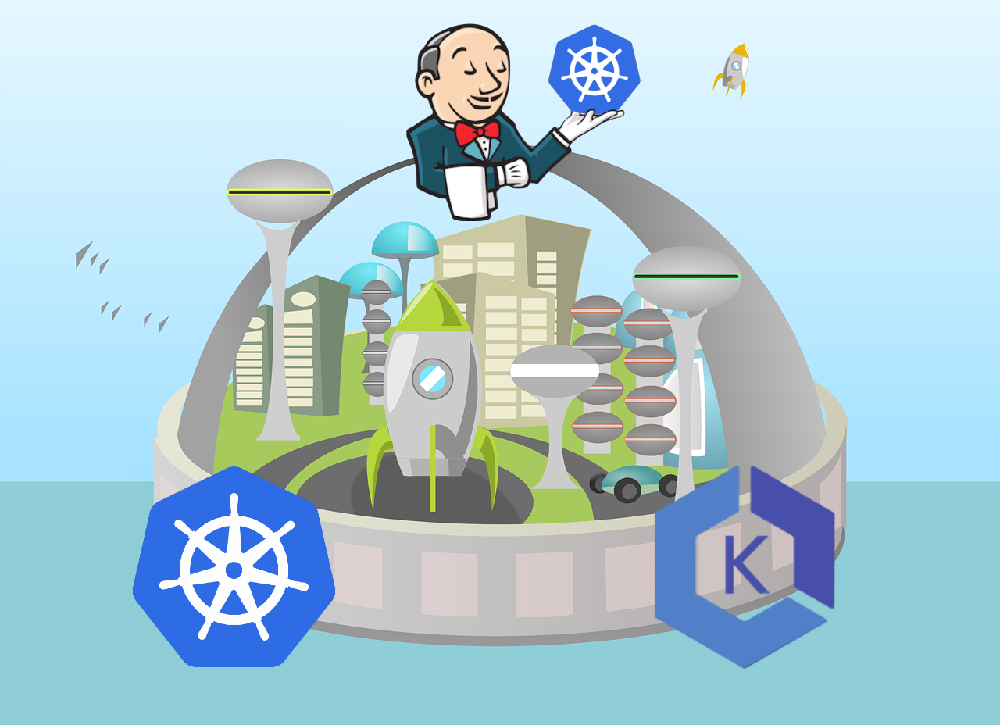
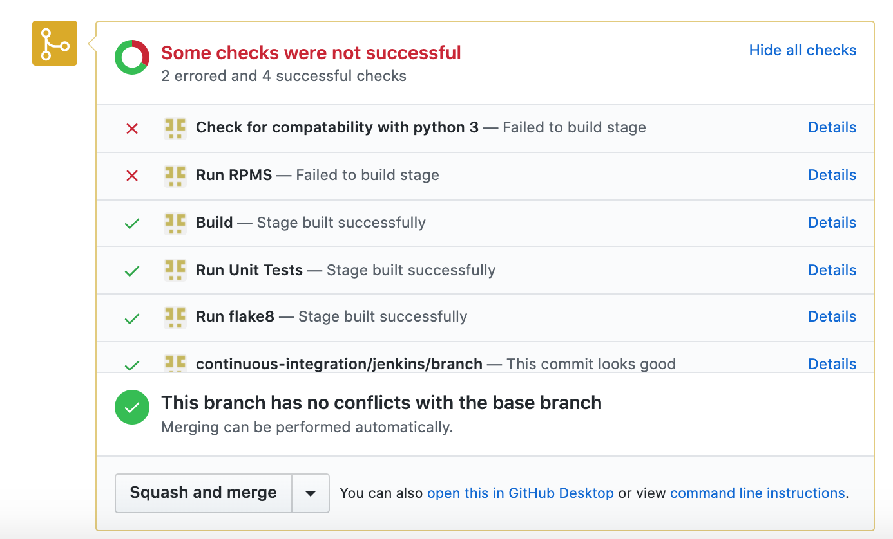
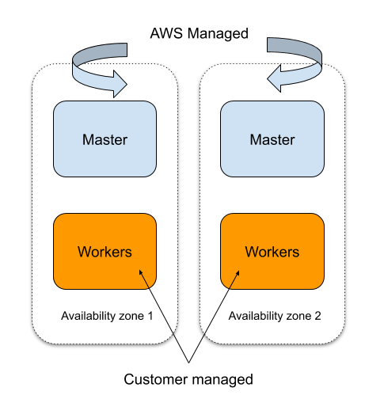
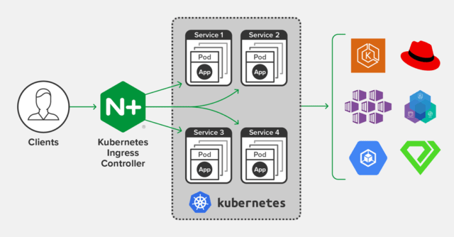
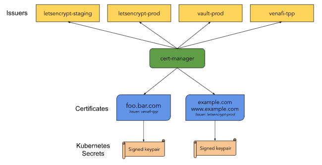

# Build CI/CD of the future with Kubernetes (AWS EKS) and Jenkins

In this tutorial, I will share my experience as a DevOps engineer at Cloudify.co of creating a CI/CD on Kubernetes (AWS EKS) and using the Jenkins and spot instances as worker nodes of the cluster.

### Building the CI/CD of the Future published posts:

* Introduction
* [Creating the VPC for EKS cluster](vpc.md)
* [Creating the EKS cluster](https://medium.com/@warolv/building-the-ci-cd-of-the-future-creating-the-vpc-for-eks-cluster-a69b085441d1)

## How to Create an EKS cluster on AWS topics

* How to create VPC on AWS for your cluster using the best practices
* The architecture of the EKS cluster, how to create an EKS cluster based on created VPC, how to make it highly available and fault-tolerant, how to use spot instances as worker nodes of the cluster
* How many node groups (AWS autoscaling groups) you need to execute your workloads.
* How to scale your cluster dynamically based on the load, using the 'Cluster Autoscaler'
* How to install and configure Ingress Nginx for EKS cluster
* Create a DNS record with route53 which points to Ingress entry point
* How to install and configure 'cert-manager' for the EKS cluster which uses CertManager and Let's Encrypt certificates

## How to install and configure Jenkins to your EKS cluster topics

* How to install Jenkins using helm
* How to attach the persistent volume to Jenkins master
* How to configure backups for Jenkins
* How to secure your Jenkins and best practices
* General Jenkins plugins we using
* How to create service-account and configure credentials to access k8s cluster from Jenkins
* How to create your first pipeline job in Jenkins and using the Kubernetes plugin

## Introduction

### What is Pull Request and why it used in the development process?

Pull requests let you tell others about changes you've pushed to a branch in a repository on GitHub. Once a pull request is opened, you can discuss and review the potential changes with collaborators and add follow-up commits before your changes are merged into the base branch.

https://docs.github.com/en/github/collaborating-with-issues-and-pull-requests/about-pull-requests

* To detect breaking changes early in the process before actually breaking the code-base for everyone.
* To ensure the quality of the code by putting your code up for review by other coworkers.
* Validate your logic from a different perspective by other developers.

### What is Continuous Integration?

In Continuous Integration after a code commit, the software is built and tested immediately. In a large project with many developers, commits are made many times during a day. With each commit code is built and tested. If the test is passed, build is tested for deployment. If deployment is a success, the code is pushed to production. This commit, build, test, and deploy is a continuous process and hence the name continuous integration/deployment.

https://www.guru99.com/jenkin-continuous-integration.html

### Why do we need CI?

To validate the code you build not breaks production by

* Running Unit tests on every push to your branch as part of Pull Request
* Running Integration Tests on every push to your branch as part of Pull Request

### How CI like Jenkins is triggered?

* Pull Request is created
* Github's webhook triggered
* The build is executed on Jenkins
* Build status received on PR

The image above shows the status of the build received on PR.
Also, I recommend you to read my post, [Perfect PR process on Github with Jenkins CI, multi-branch pipeline, and autostatus plugin](https://levelup.gitconnected.com/perfect-pr-process-on-github-with-jenkins-ci-multi-branch-pipeline-and-autostatus-plugin-33e1805dc619)
which explains in detail how to use CI like Jenkins to build your PR process with a multibranch pipeline and auto status plugin.

## The architecture of the EKS Cluster we building in this tutorial

* EKS automatically runs K8s with two masters across two AZs to protect against a single point of failure.
* This multi-AZ architecture delivers resiliency against the loss of an AWS Availability Zone.
* EKS takes care of master nodes.
* Self Healing control plane so no monitoring/alerting required for master nodes.
* Very good integration with AWS services in general.

The EKS cluster we build uses the spot instances for the workloads to run.

### Why we use spot instances with EKS?

To save up to 90% off the EC2 On-Demand price, without compromising the performance or availability of your applications.

### Components of EKS related to spot instances

* Diversified node groups (auto-scaling groups) cross AZ which consists of similar spot instances.
* Cluster Autoscaler, the component that will be in charge of automatically adjusting the size of our Spot instances node group according to the load on the cluster.

## NGINX Ingress Controller which will be used in our EKS cluster

ingress-nginx is an Ingress controller for Kubernetes using NGINX as a reverse proxy and load balancer.

https://www.nginx.com/products/nginx/kubernetes-ingress-controller/

## Using Cert Manager with Let's Encrypt in our EKS cluster

cert-manager is a native Kubernetes certificate management controller. It can help with issuing certificates from a variety of sources, such as Let's Encrypt, HashiCorp Vault, Venafi, a simple signing key pair, or self signed.
It will ensure certificates are valid and up to date, and attempt to renew certificates at a configured time before expiry.

https://cert-manager.io/docs/

## Jenkins Installation and configuration in our EKS cluster

* Jenkins master will be installed using the public helm chart with our specific set of plugins
* Daily backups will be used with s3 bucket
* The persistent volume will be used to store data/configuration of Jenkins
* Jenkins will be integrated with Vault by HashiCorp
* Kubernetes plugin will be used to configure and use Jenkins dynamic agents on k8s

To find and understand in detail what you need to integrate Vault into Jenkins, read my post: https://codeburst.io/read-vaults-secrets-from-jenkin-s-declarative-pipeline-50a690659d6

Please follow me on [Twitter (@warolv)](https://twitter.com/warolv)

My personal blog in which I will post this tutorial also: http://igorzhivilo.com

This post on my medium account: https://medium.com/@warolv/build-ci-cd-of-the-future-with-kubernetes-aws-eks-and-jenkins-84b744f26949

