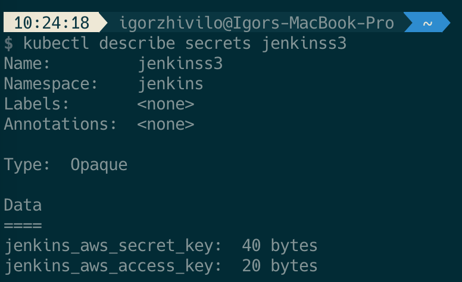
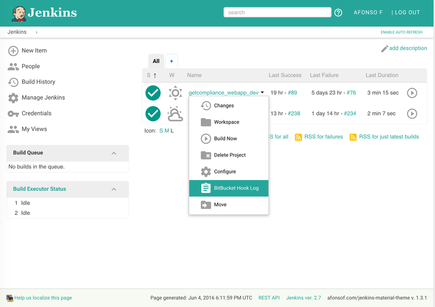

# Building the CI/CD of the Future, Install and configure Jenkins


In this tutorial, I will share my experience as a DevOps engineer at Cloudify.co, this is the fifth post of the tutorial in which I will describe how to install Jenkins with helm, configure it, use a persistent volume, and do daily Jenkins backups.

### Building the CI/CD of the Future published posts:

* [Introduction](README.md)
* [Creating the VPC for EKS cluster](vpc.md)
* [Creating the EKS cluster](eks.md)
* [Adding the Cluster Autoscaler](cluster-autoscaler.md)
* [Add Ingress Nginx and Cert-Manager](ingress-cert-manager.md)
* Install and configure Jenkins
* [Create your first pipeline](pipeline.md)

Let’s start.

## What is Jenkins?

Jenkins is a self-contained, open source automation server which can be used to automate all sorts of tasks related to building, testing, and delivering or deploying software. 

https://jenkins.io/doc/

## Install Jenkins to EKS cluster

To install Jenkins to our EKS cluster, I will use [this helm chart](https://github.com/jenkinsci/helm-charts/tree/main/charts/jenkins) and my [custom jenkins-values.yaml](jenkins/jenkins-values.yaml) to override the defaults.

## Review the configuration of jenkins-values.yaml

### Ingress definition

``` yaml
ingress:
    enabled: true
    apiVersion: "extensions/v1beta1"
    labels: {}
    annotations: 
      kubernetes.io/ingress.class: nginx
      cert-manager.io/cluster-issuer: "letsencrypt-prod"
    hostName: jenkins.eks.cicd-future.com
    tls:
      - secretName: jenkins-tls-prod
        hosts:
          - jenkins.eks.cicd-future.com
```

We enabled the Ingress rule and after Jenkins is installed, it will be accessible as **jenkins.eks.cicd-future.com**, and Let’s Encrypt certificate will be obtained for this domain. You can read about the ingress and certification mechanism in detail in the [previous post](ingress-cert-manager.md).

### Backup

``` yaml
## Backup cronjob configuration
## Ref: https://github.com/maorfr/kube-tasks
backup:
  # Backup must use RBAC
  # So by enabling backup you are enabling RBAC specific for backup
  enabled: true
  # Used for label app.kubernetes.io/component
  componentName: "backup"
  # Schedule to run jobs. Must be in cron time format
  # Ref: https://crontab.guru/
  schedule: "0 3 * * *"
  labels: {}
  annotations: {}
    # Example for authorization to AWS S3 using kube2iam
    # Can also be done using environment variables
    # iam.amazonaws.com/role: "jenkins"
  image:
    repository: "maorfr/kube-tasks"
    tag: "0.2.0"
  # Additional arguments for kube-tasks
  # Ref: https://github.com/maorfr/kube-tasks#simple-backup
  extraArgs: []
  existingSecret:
    jenkinss3:
      awsaccesskey: jenkins_aws_access_key
      awssecretkey: jenkins_aws_secret_key
  env:
  - name: "AWS_REGION"
    value: "eu-east-1"
  resources:
    requests:
      memory: 1Gi
      cpu: 1
    limits:
      memory: 2Gi
      cpu: 1
  destination: "s3://jenkins-backups"
```

To use backups we using [kube-tasks](https://github.com/maorfr/kube-tasks), it’s a simple mechanism that copy files of /var/jenkins_home (Jenkins master POD) folder on daily basis to s3 bucket, using the Kubernetes scheduled job.

To enable this mechanism you need to define your backup schedule in cronjob format like: ‘0 3 * * *’ and to have access to s3 bucket, using [kube2iam](https://github.com/jtblin/kube2iam) or in my case, I created a specific user in AWS with access to S3. If you using AWS user like I do you need to store the credentials (aws_access_key / aws_secret_key) of this user as kubernetes secret, you can create a secret by running this command:

``` bash
$ kubectl create secret generic jenkinss3 /
--from-literal=jenkins_aws_access_key=ACCESS_KEY /
--from-literal=jenkins_aws_secret_key=SECRET_KEY
```

ACCESS_KEY is aws_access_key you got from your user, after choosing programmatic access and exporting creds. SECRET_KEY is an aws_secret_key you exported.

The secret name is jenkinss3:



This mechanism worked for a couple of months till I found that 3 last jobs in a failed state and logs revealed ‘error in Stream: command terminated with exit code 1 src: file:”, you can read about this issue [here](https://github.com/nuvo/kube-tasks/issues/2). Failure occurs when files in /var/jenkins_home folder changing during upload to s3 bucket. This problem not [solved](https://github.com/nuvo/kube-tasks/issues/2), so my solution was to build this [simple scheduled job](https://gist.github.com/warolv/1dbe6efed66d3111decae825b7b73241) which will archive /var/jenkins_home folder and uploads it to s3 on a daily basis.

You can read more about this solution [here](https://medium.com/swlh/simple-backup-for-jenkins-on-kubernetes-f24743de7499).

### Persistent volume

``` yaml
persistence:
  enabled: true
  ## A manually managed Persistent Volume and Claim
  ## Requires persistence.enabled: true
  ## If defined, PVC must be created manually before volume will be bound
  existingClaim:
  ## jenkins data Persistent Volume Storage Class
  ## If defined, storageClassName: <storageClass>
  ## If set to "-", storageClassName: "", which disables dynamic provisioning
  ## If undefined (the default) or set to null, no storageClassName spec is
  ##   set, choosing the default provisioner.  (gp2 on AWS, standard on
  ##   GKE, AWS & OpenStack)
  ##
  storageClass:
  annotations: {}
  accessMode: "ReadWriteOnce"
  size: "8Gi"
  volumes:
  #  - name: nothing
  #    emptyDir: {}
  mounts:
  #  - mountPath: /var/nothing
  #    name: nothing
  #    readOnly: true
```

We need a persistent volume for Jenkins to store all configuration and make sure the data not lost after POD restarted or worker node is rebooted.

It will use the default storage class:


if not selected otherwise, in my case it’s AWS EBS.

### Set of plugins I am using

``` yaml
# List of plugins to be install during Jenkins master start
  installPlugins:
    - kubernetes:1.25.3
    - workflow-job:2.38
    - workflow-aggregator:2.6
    - credentials-binding:1.23
    - git:4.2.2
    - configuration-as-code:1.39
    - greenballs:1.15
    - google-login:1.6
    - github:1.29.5
    - blueocean:1.23.1
```

* [Jenkins Kubernetes plugin](https://plugins.jenkins.io/kubernetes/)
* Plugins for the pipeline in Jenkins
* [blueocean plugin](https://www.jenkins.io/projects/blueocean/) which is very useful
* [google-login plugin](https://plugins.jenkins.io/google-login/') which lets you log in to Jenkins with your Google account
* [simple-theme-plugin](https://plugins.jenkins.io/simple-theme-plugin/) which makes Jenkins UI sexier, I personally use material-theme



### Create and configure service-account

In order for Jenkins to be authenticated/authorized to the Kubernetes cluster, we need to create a service account. The service account is bound to cluster roles and can be granted certain cluster privileges.

In jenkins-values.yaml you must enable service-account creation:

``` yaml
serviceAccount:
  create: true
  name: jenkins
  annotations: {}
```

Then you must grant to you service-account cluster-admin role by running this command:


``` bash
$ kubectl create clusterrolebinding jenkinsrolebinding --clusterrole=cluster-admin --group=system:serviceaccounts:jenkins
```

Now Jenkins can access the Kubernetes cluster and create/update/delete different Kubernetes resources like pods/deployments/services …

You can read more about RBAC Authorization [here](https://kubernetes.io/docs/reference/access-authn-authz/rbac/).

### Install Jenkins master on the cluster to jenkins namespace

Assuming your custom values.yaml for Jenkins helm chart is jenkins-values.yaml

``` bash
$ kubectl create namespace jenkins

$ helm install jenkins -f jenkins-values.yaml stable/jenkins --namespace jenkins
```

### Get the admin password of Jenkins

``` bash
printf $(kubectl get secret --namespace jenkins jenkins -o jsonpath="{.data.jenkins-admin-password}" | base64 --decode);echo
```

The only thing left is to open Jenkins in the browser and login using the admin password you have from the previous step.

I the next post I will show you how to use a created service account on Jenkins and how to run a simple pipeline job that lists all pods in the Kubernetes cluster.

In this post, I explained how to install Jenkins, did an overview of my custom configuration, how to configure ingress rules, do daily backups, use persistent volume to store all the data, my set of plugins, how to create a service account with access to the Kubernetes cluster.

Please follow me on [Twitter (@warolv)](https://twitter.com/warolv)

My personal blog in which I will post this tutorial also: https://igorzhivilo.com

This post on my medium account: https://medium.com/@warolv/building-the-ci-cd-of-the-future-install-and-configure-jenkins-c17feea00ef7